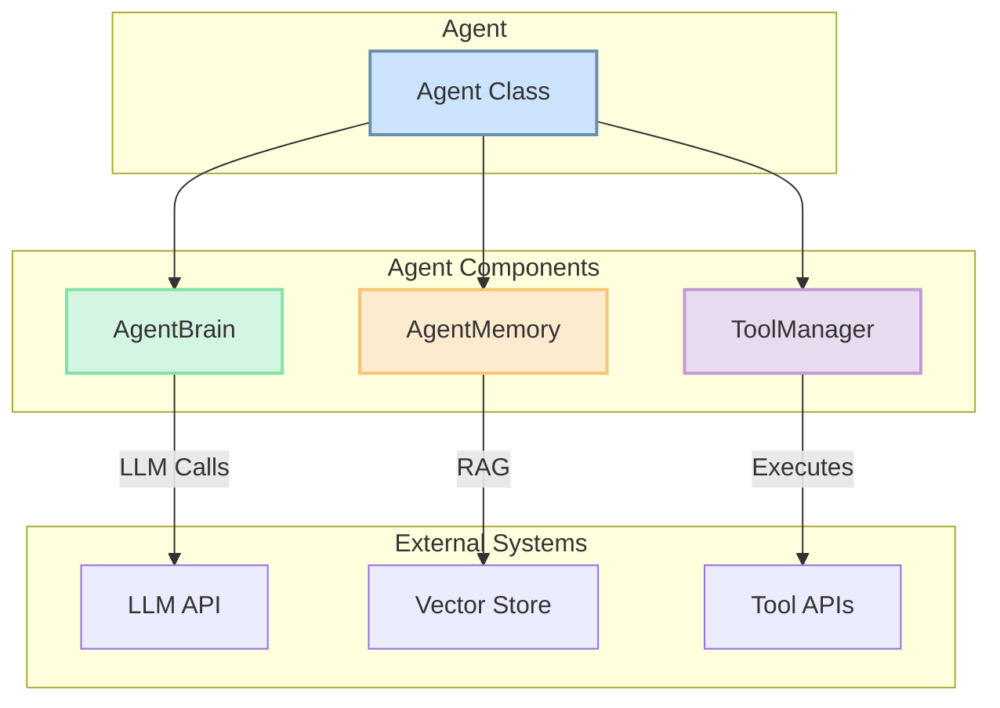

# Agent Architecture Design (Task 5.2)

## 1. Overview

This document outlines the detailed architecture for individual agents within the Autonomica OWL/CAMEL system. The design follows a modular, component-based approach to enhance scalability, maintainability, and clarity. It separates an agent's core concerns—**brain (reasoning)**, **memory**, and **tools**—into distinct, composable components.

This design is implemented in `autonomica-api/app/owl/agent.py`.

## 2. Architecture Diagram

The following diagram illustrates the high-level architecture of a single agent:

## 3. Core Components

The architecture is composed of four primary classes:

### 3.1. `Agent` Class

This is the main container class that represents a complete agent. It holds the agent's identity (`id`, `name`, `type`) and composes the other core components.

-   **Responsibilities**:
    -   Maintain overall agent state (e.g., `status`).
    -   Orchestrate the interaction between the brain, memory, and tools.
    -   Serve as the primary interface for the `Workforce` to interact with the agent.
    -   Manages the agent's available tools, validates tool calls, and executes them. It abstracts the complexities of different tool APIs.

### 3.2. `AgentBrain`

This is the central reasoning engine of the agent. It encapsulates the logic for decision-making and task processing.

-   **Responsibilities**:
    -   Hold the agent's `system_prompt` and selected `model`.
    -   Implement the core reasoning loop (e.g., a ReAct or Plan-and-Execute pattern).
    -   Interact with LLM APIs to generate thoughts, plans, and final responses.
    -   Decide when to use a tool and what actions to take based on the current context.

### 3.3. `AgentMemory`

This component is responsible for all aspects of memory management, giving the agent context and the ability to learn.

-   **Responsibilities**:
    -   Manage **short-term memory** (i.e., the current conversation history).
    -   Interface with a **long-term memory** backend (e.g., a FAISS or Redis vector store) for Retrieval-Augmented Generation (RAG).
    -   Provide methods for adding new information and retrieving relevant memories.

### 3.4. `ToolManager`

This component manages the tools (or skills) that an agent can use to interact with external systems.

-   **Responsibilities**:
    -   Maintain a list of `available_tools` for the agent.
    -   Load and instantiate the necessary toolkits (e.g., `SearchToolkit`, `CodeExecutionToolkit`).
    -   Provide a unified interface for the `AgentBrain` to execute tools and receive their outputs.

## 4. CAMEL Communication Protocol

The CAMEL (Communicative Agent-based Model and Embodied Language) protocol is implemented to facilitate structured, reliable communication between agents.

- **File**: `communication.py`

### a. Message Structure (`CamelMessage`)
All inter-agent communication is encapsulated in a `CamelMessage` object, which consists of a `header` and a `payload`.

-   **`MessageHeader`**: Contains metadata for routing and context.
    -   `message_id`: A unique UUID for the message.
    -   `sender_id`: The ID of the agent sending the message.
    -   `recipient_id`: The ID of the target agent, agent type (`TYPE:<type>`), or broadcast (`ALL`).
    -   `message_type`: An enum (`MessageType`) defining the purpose of the message (e.g., `TASK_ASSIGNMENT`, `DATA_REQUEST`).
    -   `timestamp`: The UTC timestamp of message creation.

-   **`payload`**: A dictionary containing the actual data of the message, which is validated against a specific Pydantic model based on the `message_type`.

### b. Message Types and Payloads
The `MessageType` enum defines a standardized set of interaction types. Each message type corresponds to a `BasePayload` Pydantic model that defines the expected data structure for that message.

**Examples:**
-   **`TASK_ASSIGNMENT`**: Uses `TaskAssignmentPayload` to assign a new task to an agent. Requires `task_id`, `task_title`, `task_description`, and `inputs`.
-   **`STATUS_UPDATE`**: Uses `StatusUpdatePayload` to report the status of a task. Requires `task_id` and `status`.
-   **`DATA_REQUEST`**: Uses `DataRequestPayload` to request information from another agent. Requires `query` and `source_task_id`.

This standardized, model-driven approach ensures that all communication is explicit, validated, and less prone to errors.

## 5. Agent Interaction Workflow (Example)

1.  The **`AutonomicaWorkforce`** receives a high-level goal.
2.  The **CEO Agent** receives the goal and uses its `AgentBrain` to decompose it into smaller tasks.
3.  The **CEO Agent** creates a `CamelMessage` with `message_type = TASK_ASSIGNMENT` and a corresponding `TaskAssignmentPayload`. It sets the `recipient_id` to a specific agent type (e.g., `TYPE:SEO_RESEARCHER`).
4.  The message is placed in the CEO's `outbox`.
5.  The **`AutonomicaWorkforce`**'s routing mechanism picks up the message and delivers it to the `inbox` of all `SEO_RESEARCHER` agents.
6.  Each **SEO Researcher** processes the message from its `inbox`, executes the task, and sends back a `STATUS_UPDATE` or `DATA_RESPONSE` message.

## 6. Advantages of this Architecture

-   **Modularity**: Each component has a single, well-defined responsibility, making the system easier to understand, test, and maintain.
-   **Scalability**: New memory backends, reasoning patterns, or tools can be added by creating new component implementations without changing the core `Agent` class.
-   **Flexibility**: Different agents can be composed with different `AgentBrain` or `ToolManager` implementations, allowing for highly specialized agent behaviors.
-   **Clarity**: The separation of concerns makes the agent's internal processes explicit and easier to debug. 